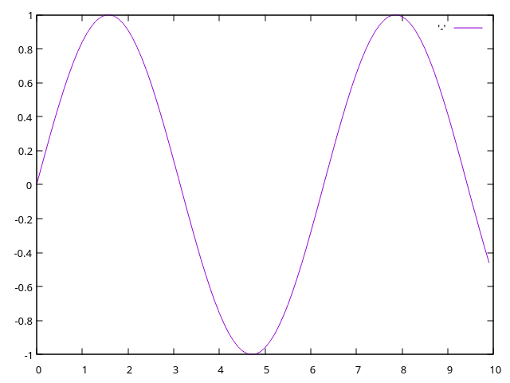
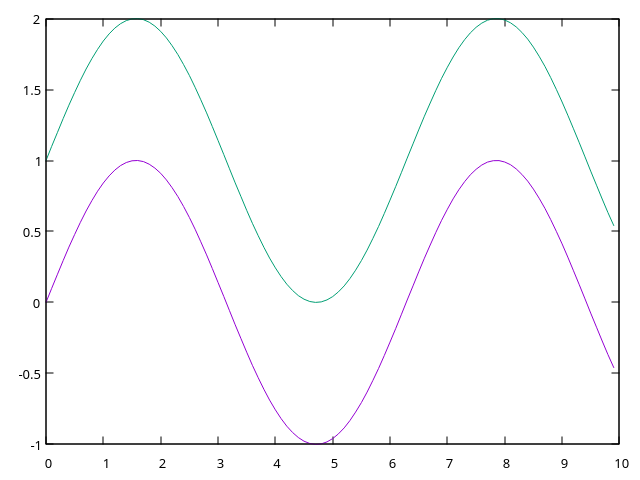
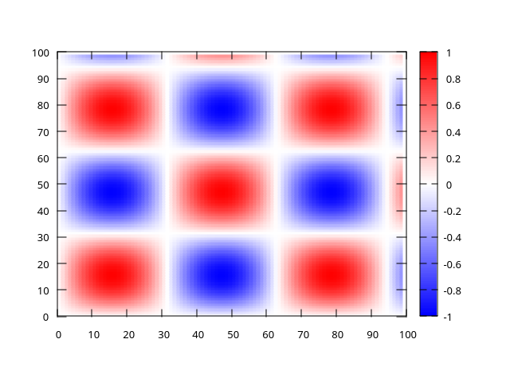
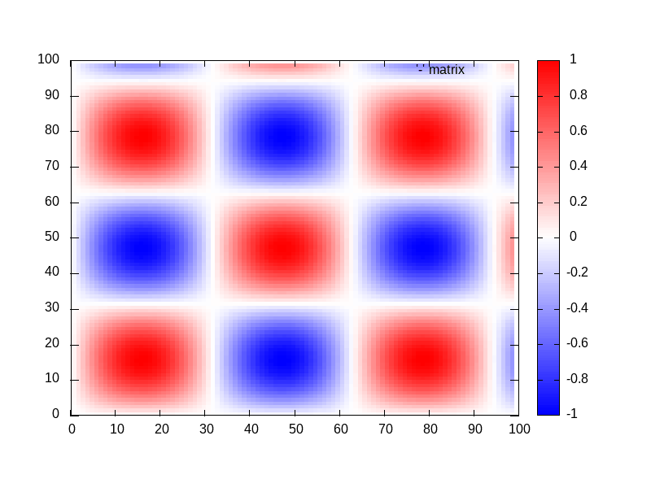

# q-plotter

Simple plotting interface for KDB+/Q

## Requirements

GNUPlot is required. For Linux/WSL you can use:

```bash
sudo apt update
sudo apt install gnuplot
```
For other platforms visit the GNUPlot homepage [here](http://www.gnuplot.info/).

## Getting Started

Run

```bash
make
```

This will generate the `plt.so` file. 


You can move this to your `$QHOME/l64` directory to have the shared object available from other directories.

```bash
cp plt.q $QHOME
cp plt.so $QHOME/l64
```


## Motivation

When I need to quickly visualise something in Q, I either have to move outside my preferred IDE to developer or save the data as a CSV and plot in Excel. This is inconvenient and slows down workflows, the following is preferrable:

```q
\l plt.q
.plt.plt[x;y]
```

## Examples

Here are a couple examples of the API endpoints

### Normal Plot

```q
q examples/sinewave.q
```



### Multi Plot

```q
q examples/multiplot.q
```



### Heatmap

```q
q examples/heatmap.q
```



### Animated Heatmap

```q
q examples/animation.q
```

